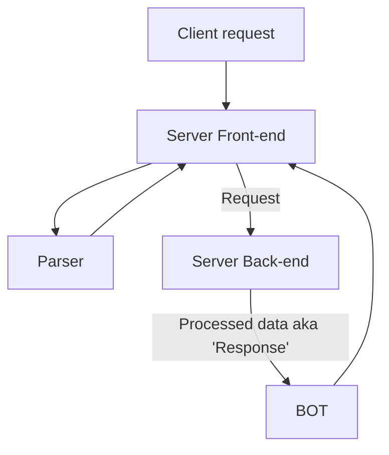

# ft_irc
---
IRC server in C++98

# Resources
---
### Main document
- [Internet Relay Chat Protocol](https://datatracker.ietf.org/doc/html/rfc1459)
### Extensions and additions
- [Internet Relay Chat: Channel Management](https://datatracker.ietf.org/doc/html/rfc2811)
- [Internet Relay Chat: Client Protocol](https://datatracker.ietf.org/doc/html/rfc2812)
- [Internet Relay Chat: Server Protocol](https://datatracker.ietf.org/doc/html/rfc2813)
- [Internet Relay Chat: Architecture](https://datatracker.ietf.org/doc/html/rfc2810)
- [Example IRC Communications](http://chi.cs.uchicago.edu/chirc/irc_examples.html)
- [chirc](http://chi.cs.uchicago.edu/chirc/index.html)

# Contributers
---
- 42 intra: [amenses-](https://profile.intra.42.fr/users/amenses-)
- 42 intra: [amitcul](https://profile.intra.42.fr/users/amitcul)

# Design (draft)

## Extra sources
---
- [How to organize project](https://api.csswg.org/bikeshed/?force=1&url=https://raw.githubusercontent.com/vector-of-bool/pitchfork/develop/data/spec.bs#intro)
